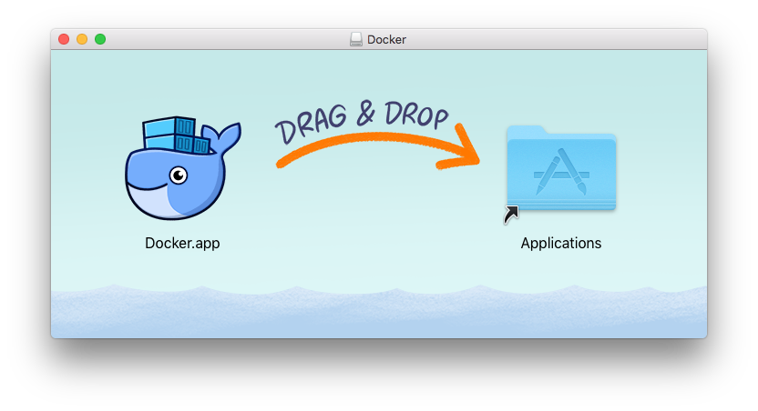
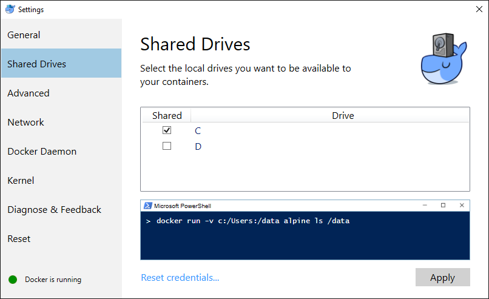

# Install Docker (for Mac & Windows)
In this lab Docker will be used to run our Jenkins server.  

Docker for Mac and Docker for Windows are designed to enable easily running containers on your local machine.  The following instructions explain step-by-step how to do this. 

## Install Docker for Mac
Download Docker for Mac from the following URL. 
https://download.docker.com/mac/stable/Docker.dmg

Double click the DMG file to open it and then drag the Docker for Mac binary over to the Applications folder. 



Now open the Applications folder and double click `Docker.app` 


When Docker opens you will be prompted to authorize it with your system password. 

After this is complete wait a few minutes and Docker for Mac will start. 

Launch a terminal and type the following to confirm Docker is working as expected. 

```
docker run hello-world
```

You should see something similar to the following. 

```
Hello from Docker!
This message shows that your installation appears to be working correctly.

To generate this message, Docker took the following steps:
 1. The Docker client contacted the Docker daemon.
 2. The Docker daemon pulled the "hello-world" image from the Docker Hub.
    (amd64)
 3. The Docker daemon created a new container from that image which runs the
    executable that produces the output you are currently reading.
 4. The Docker daemon streamed that output to the Docker client, which sent it
    to your terminal.
```

Now that Docker is installed continue onto the section “Install Jenkins” 

## Install Docker for Windows
Download Docker for Windows from the following URL: 
https://download.docker.com/win/stable/Docker%20for%20Windows%20Installer.exe

1. Double click the exe file to start the installation
2. Follow the install wizard and authorize Docker with your system password. 
3. Click Finish to complete the installation. 


Docker does not start automatically so we need to launch it from the Windows start menu.  

Click Windows start button and search for Docker, then click on “Docker for Windows” 


Check the whale in the status tray to confirm it is steady. 


Launch a command window and type the following to confirm Docker is working as expected. 
```
docker run hello-world 
```

You should see something similar to the following. 

```
Hello from Docker!
This message shows that your installation appears to be working correctly.

To generate this message, Docker took the following steps:
 1. The Docker client contacted the Docker daemon.
 2. The Docker daemon pulled the "hello-world" image from the Docker Hub.
    (amd64)
 3. The Docker daemon created a new container from that image which runs the
    executable that produces the output you are currently reading.
 4. The Docker daemon streamed that output to the Docker client, which sent it
    to your terminal.
```

Now that Docker is installed we need to enable shared folders 

Right click the Docker icon in the system tray and click “Preferences” 

In the new window click “Shared Drives” and then make sure you have selected the drives you will be using. 

Then execute the `docker run` command shown below in a PowerShell to test it. 



## Confirm Docker Compose was installed 
Now that we have Docker for Windows, or Docker for Mac installed we need to confirm that Compose was installed. 


## Lab Complete! 