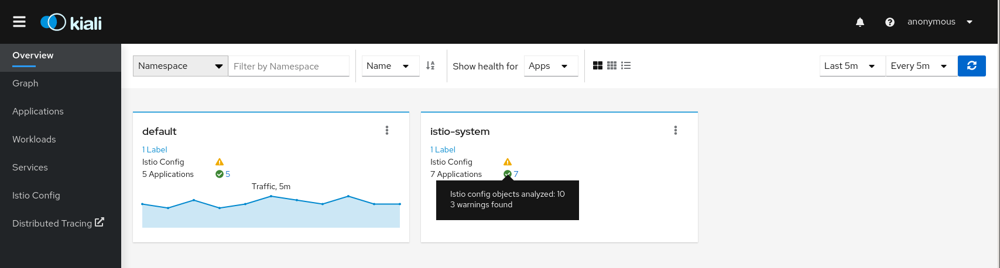
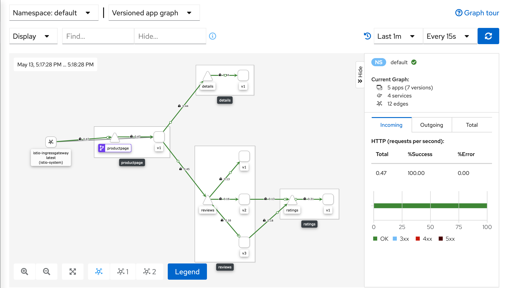
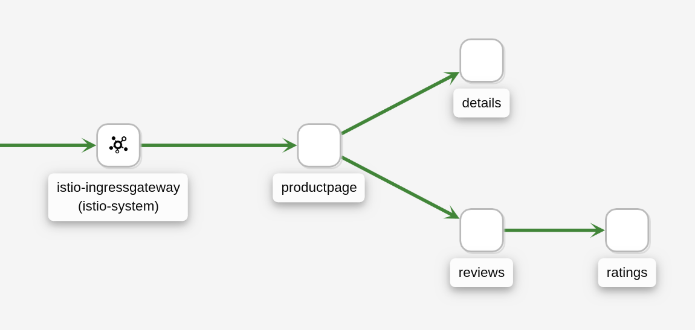
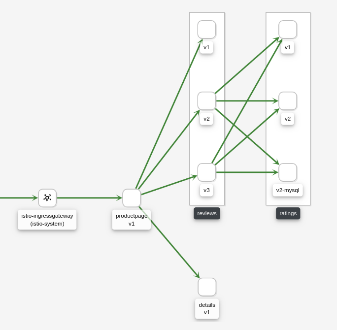
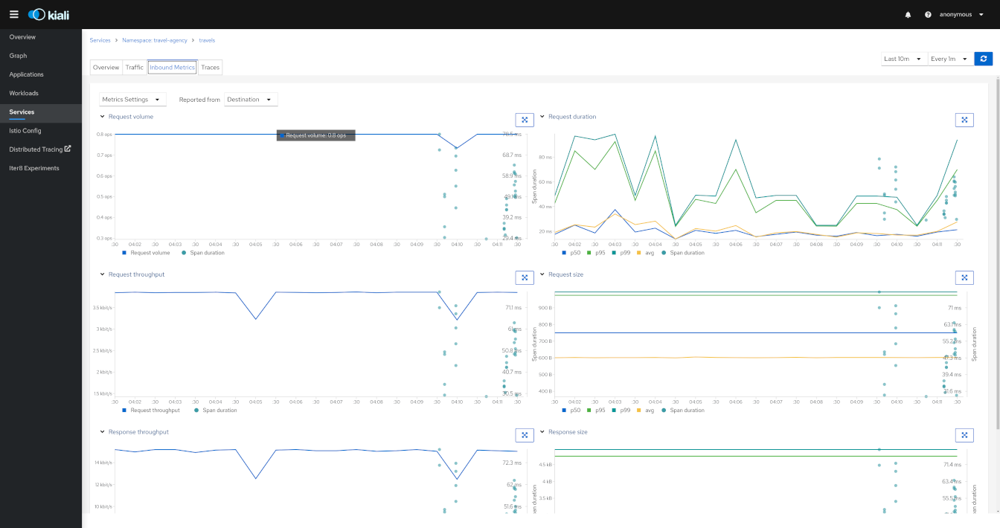
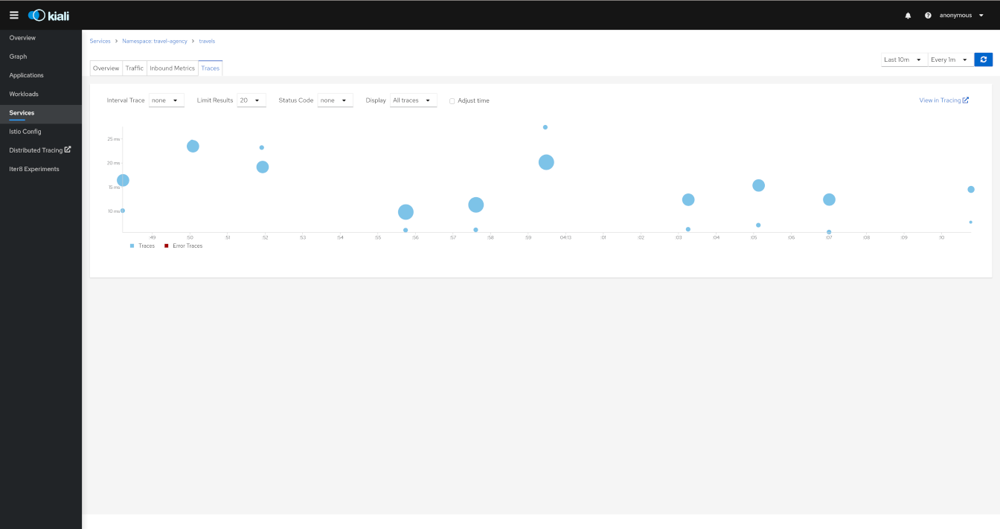

## Kiali Dashboard
Istio integrates with several different telemetry applications. These can help you gain an understanding of the structure of your service mesh, display the topology of the mesh, and analyze the health of your mesh.

Kiali is a dashboard that provides visibility into your Istio service mesh. 

### Install Isio Addons 
The following command will install Kiali and some additional components for tracing, monitoring and visualization of your applications. 
* Jaeger
* Grafana
* Kiali
* Prometheus

To install the addons run the following: 
```
kubectl apply -f samples/addons
```

Confirm the deployment was successful
```
kubectl rollout status deployment/kiali -n istio-system
```


If there are errors trying to install the addons, try running the command again. There may be some timing issues which will be resolved when the command is run again. 

To open the Kiali UI, execute the following command:   
```
kubectl -n istio-system port-forward $(kubectl -n istio-system get pod -l app=kiali -o jsonpath='{.items[0].metadata.name}') 8080:20001
```

Open your browser by clicking on “Preview on port 8080”:


View the overview of your mesh in the Overview page. The Overview page displays all the namespaces that have services in your mesh.


In the left navigation menu, select Graph and in the Namespace drop down, select default.

The Kiali dashboard shows an overview of your mesh with the relationships between the services in the Bookinfo sample application. It also provides filters to visualize the traffic flow.



To view a summary of metrics, select any node or edge in the graph to display its metric details in the summary details panel on the right.

To view your service mesh using different graph types, select a graph type from the Graph Type drop down menu. There are several graph types to choose from: App, Versioned App, Workload, Service.

The App graph type aggregates all versions of an app into a single graph node. The following example shows a single reviews node representing the three versions of the reviews app.


The Versioned App graph type shows a node for each version of an app, but all versions of a particular app are grouped together. The following example shows the reviews group box that contains the three nodes that represents the three versions of the reviews app.



## Tracing
Istio integrates with Jaeger to provide Span duration and tracing details. 

To see tracing for troubleshooting your microservices click on the **Services** tab and select **Metrics Settings**.


Users can navigate to the traces tab to browse filtered traces for a given service in the time interval or to show details for a single trace.

The tracing toolbar offers some control over the data to fetch, to facilitate the user experience. In the tracing view, as shown in the image below, it’s possible to select the traces interval, results limit, status code, errors, adjust time (expand results on time), last Xm traffic (Traces from last minutes) and refresh interval.

After selecting a trace, Kiali shows the information related to that trace like number of spans, spans grouped by operation name, duration, date.



